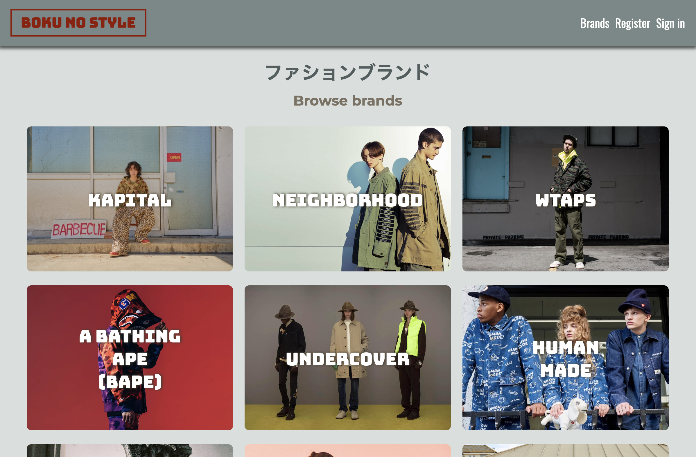
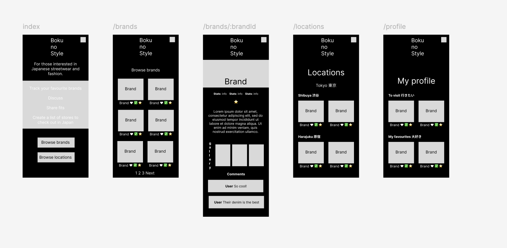
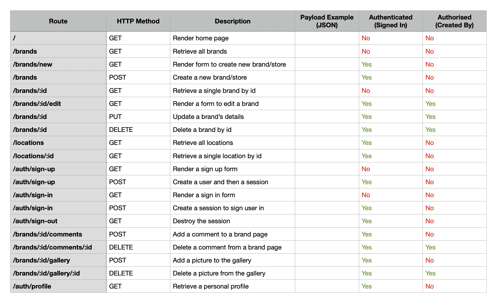
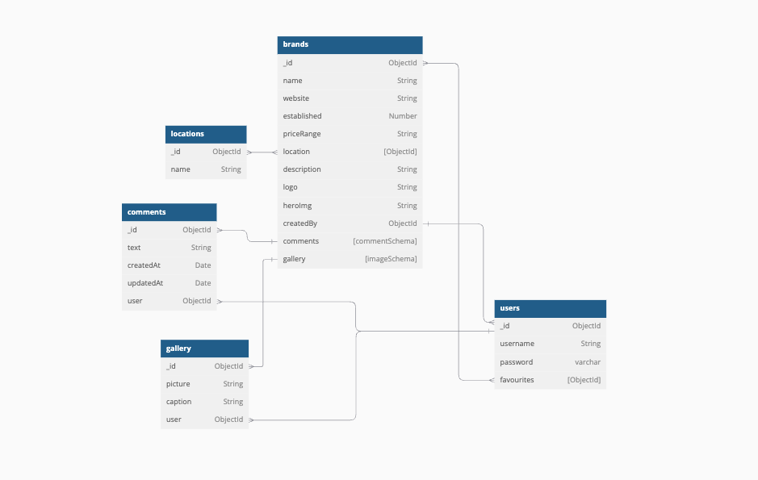
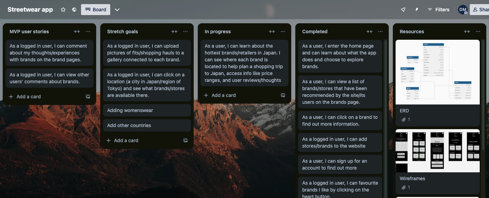
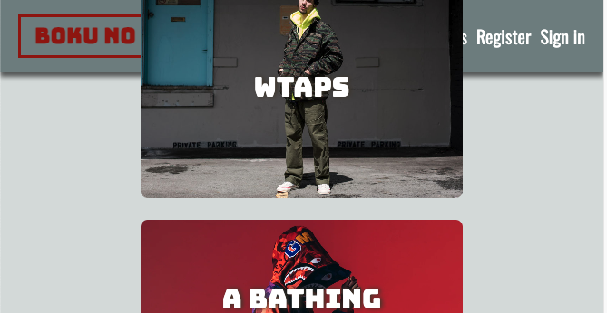
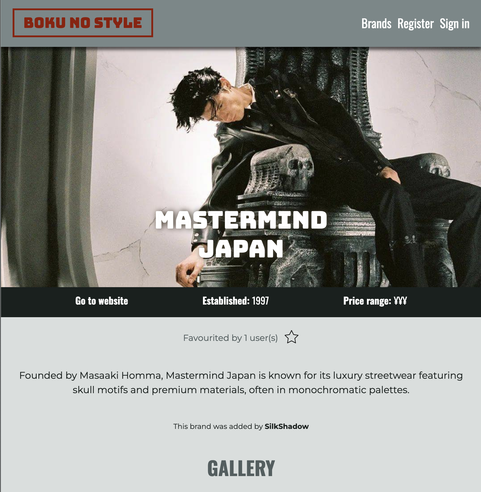

# boku-no-style



## Description

*Boku no Style* is an app designed for enthusiasts of Japanese streetwear fashion - or people who are interested in finding out more about it!

I was inspired to create this app after living in Japan for two years, which was when I became particularly interested in and passionate about its unique and storied fashion scene. Although there are some resources out there for Western and other non-Japanese fans of Japanese fashion, it is mainly led by passionate members of the community and there can be a high barrier to entry - a combination of language, different countries, difficulty shipping, and more makes it difficult to research and obtain pieces.

So it seemed like a gap in the market for this kind of resource - I also knew there was a keen demand to tap into.

Japan is also a hugely popular tourist destination, with its cities being major attractions - shopping is a popular activity while on a city break, so the app is intended to help users research potential brands they would like to visit while on vacation. People often want something unique - I personally had many friends ask me for recommmendations on where to buy cool pieces while they were visting.

The app allows users to view different brands and find out more information about them. If they are logged in, they can add brands to their favourite list and add any new brands they discover.

A key aspect is the social 'community' nature of the app. Users can upload pictures to each brand's 'gallery' section, such as selfies, clothing hauls, etc.

'Boku no' translates to 'My' in Japanese, so the app is essentially called 'My Style'. If I were developing this as a concept, you could expand on this idea and create hubs for different countries - a 'Mon Style' for people wanting to learn about France's fashion gems, for instance!

## Deployment link

[Boku no Style](https://boku-no-style.netlify.app/)

## Timeframe

This was a solo project created over the course of one week.

## Technologies used

*Boku no Style* is a full-stack project developed in *VS Code* using the following technologies:
* MEN Stack
    * MongoDB
    * Express
    * Node.js
* HTML
* CSS
* JavaScript

## Brief

This was the second project I completed as part of my software engineering bootcamp at General Assembly.

The brief was to create a MEN Stack app with full CRUD functionality. As a minimum, it needed to:
* Utilise EJS templates to render views to users
* Include session-based authentication
* At least two data entities, including a User model
* Full CRUD functionality
* Feature authorisation - only logged in users can create, update, or delete data
* Be deployed online

## Planning

Given that this is an app about fashion, I decided early on that I wanted it to be visual heavy and make use of photography to best showcase the subject matter.

I developed a wireframe plan of the site's main pages in *Figma*. The app was designed with a mobile-first design philosophy.



I also created a moodboard to help establish the look and feel of the app. I was particularly inspired by the design ethos of Japanese fashion/lifestyle magazines *Popeye* and *Fruits*.

I really wanted to create something that felt authentic and true to the subject matter. As such, drawing from this inspiration, I decided to include features such as white text over large images, chunky 'bubble'-like fonts, and vertical text strings.


This research also inspired my colour scheme. In its very name, streetwear is fashion that people wear out and about, on the streets. In the fashion covers I found, I loved how the steets themselves were an important, harmonious part of the photography, serving as a vital backdrop to highlight the models and clothes.

I decided to literally use the colours that made up these street views as my site's colour scheme - featuring an array of natural colours combined with the cool artificial colours of materials like concrete and reflective glass.

Work to plan the backend of the app was also completed - I made a routing table planning my desired routes and an ERD table outlining my database and the relationships between data.





I outlined my user stories on *Trello* to track my tasks.



## Build/Code process

The first step was to create a functioning website, so it made sense to start things off by creating a server and landing page.

To better organise the code, I then created a controller file called `brands.js` to define all the CRUD routes needed for the fashion brand pages. This included `GET` routes for all associated pages - like the index, show, new form, and edit form pages. It also contains the `CREATE`, `PUT`, and `DELETE` routes for full functionality.

I also created a separate `auth.js` controller file to handle sign up and sign in routes and pages. Having these separate files allowed my `server.js` file to remain nice and lean, as can be seen in its final iteration:

```
//! -- Route handlers
//* -- Landing page
app.get('/', async (req, res) => {
    res.render('index.ejs')
})

//* -- Controllers
app.use('/brands', brandsController)
app.use('/auth', authController)

//! -- 404
app.get('*', (req, res) => {
    return res.status(404).render('404.ejs')
})
```

The navbar was created as a partial so that it could be easily integrated into all other pages as necessary without unecessarily duplicating the code.

For this project, I required two main models: a user model and a brands model, which were created using *Mongoose*.

I decided to implement seeding to improve the testing and development process - it was very useful to have a clean set of test data to return to after testing. This also made it easier to add new features, such as adding an `addedBy` field to brands after initial set up. This field allowed me to assign a user as the 'owner' of each brand, which in turn enabled me to implement authorization and ensure only owners could edit or delete their own brands.

By this point, I had achieved my goal of hitting MVP well within half of my total timeframe for the whole project, which meant I had sufficient time to add additional features and styling.

After MVP, my first priority was to add the ability to 'like' brands, as this was a core feature of the intended website. This was achieved by implementing a many-to-many relationship between brands and users. This was the most complex part of the project so far, and required reading around on how to implement.

I used a `push()` method to add the user's id to an array called 'fans' in the brand model. My thinking here was it would allow me to easily display the number of people who had favourited each brand on their pages. I then created a virtual field on the user model to allow users to access a list of all the brands they like on their profile. In hindsight, I think it would make sense to do this the other way round.

```
//Add to favourites
router.post('/:brandId/favourites', isSignedin, async (req, res, next) => {
    try {
        const brand = await Brand.findById(req.params.brandId)
        if (!brand) return next()       
        brand.fans.push(req.session.user._id)
        await brand.save()
        return res.redirect(`/brands/${req.params.brandId}`)
    } catch (error) {
        console.log(error)
        //add error message
        return res.redirect(`/brands/${req.params.brandId}`)
    }
})
```

At this stage, the website was still very basic, so I implemented some initial styling. In the future, I think it would make sense to do a little more of this as I go along, as a little goes a long way to making the project feel more complete, which was good motivation.

Because this is a fashion website, imagery is very important, so I added the ability to upload images when creating brands. I used *cloudinary* to host images, and images are automatically uploaded there when users add images to forms:

```
//Post image to gallery
router.post('/:brandId/gallery', isSignedin, upload.single('image'), async (req, res, next) => {
    try {
        req.body.user = req.session.user._id
        req.body.image = req.file.path
        const brand = await Brand.findById(req.params.brandId)
        if (!brand) return next()
        brand.gallery.push(req.body)
        await brand.save()
        return res.redirect(`/brands/${req.params.brandId}`)
    } catch (error) {
        console.log(error)
        return res.redirect(`/brands/${req.params.brandId}`)
    }
})
```

The bulk of the styling was then added. I wanted the app to work well and scale across mobile and desktop screens, so it was important to me to ensure images scaled correctly and that both views had a complete look.

The ability to upload images to the gallery was also added and went smoothly after already implementing it once. I wanted to challenge myself by adding more than just simple comments, so I am pleased with how this went.

I thought it would be really cool to display the gallery as a carousel of images. I implemented *bootstrap* to help me do this.

## Challenges

One of the early challenges I faced was trying to implement too many features at once. This made me realise that it was far more effective to break the project down into more manageable steps. That's one thing I really learned from this project, it helps if you are clear on a set order - and be ok with the fact that you may expand on parts later. It's important to check the steps are working correctly before implementing more complex parts.

The biggest issue I faced was when I accidentally broke the whole project. When installing a dependency, I saw a message about it having vulnerabilities - because I am new to this, I interpreted this an a problem with my project. So, I followed the directions to force an update and broke the app! I learned the hard way that these are general issues and not ones specific to my app that actually need addressing - it's safe to say I won't be making that error again! I managed to solve this by deleting the lines of code that had my dependencies in the `package.json` file, then removing `node_modules` and `package-lock.json` before re-installing all my dependencies afresh.

Creating the cards for each brand on the index page was one of the most challenging aspects to get right, and I am very pleased with how they eventually worked out. I did a lot research and experimenting to ensure that they worked as intended. Getting the text to sit in the centre of the brand cards required the card to use `relative` positioning using CSS. The title, a child element of this card, then used `absolute` positioning.

```
.brand-card {
    position: relative;
    transition: 0.3s;
}

.brand-title {
    color: white;
    font-size: 30px;
    position: absolute;
    top: 50%;
    left: 50%;
    transform: translate(-50%, -50%);
    text-align: center;
    font-family: 'Bungee Inline';
    text-shadow: 2px 0 5px #453d2e;
}
```

This was the part of the project which required the most work to get my head around. Even after creating them, I then had the problem of them scrolling on top of the nav header when scrolling down:



After some research, I discovered that setting the z-value of the `sticky` navbar fixed this issue.

With mobile and desktop views in mind, you have to strive to create a design that looks good across two different viewpoints. Some, like the brands index and profile pages, immediately scaled well between the two views. The show page was one I found most difficult to get right - I liked the way it looked on mobile view but not on a bigger screen at first. To counteract this, I decided to set a max width to preserve the integrity of the layout. I added a darker `background-color` to the sections outside of the main content to improve the look. This is something I want to research further as I believe it's really important for a website to look good at different widths in the modern age.

```
main {
    background-color: #525e5f;
}

.content {
    max-width: 800px;
    margin-left: auto;
    margin-right: auto;
    background-color: #D9DEDD;
    color: #19201e;
}
```

I implemented bootstrap to make a carousel to display images in the gallery on brand show pages. This required adding bootstrap's stylesheet. Because I implemented this at a later stage, it altered some of the previous styling I had already implemented, ruining the effect I had created. This taught me that it would have been wiser to plan ahead and implement this at the beginning of the project.

In particular, my logo was changed because it has a border around the text. I didn't want to put the bootstrap css stylsheet on all my other pages, because this would alter and break a lot of styling on other pages as well. But as it stood, my logo now changed between the show page and other pages, which was bad. So, I had to check through everything with a fine-toothed comb by inspecting every part of the page using dev tools in *Chrome*.

Eventually, I identified that the problem was that the bootstrap stylesheet altered the line height, which my personal stylsheet did not. This was causing the logo to display differently. It was very satisfying to finally pinpoint the culprit!

## Wins

Ultimately, I am really pleased with the look and feel of the site - I challenged myself to make it visual heavy and use images as backgrounds, and was happy with how the show page turned out.



I got the images to scale appropriately to fit the exact shape of the cards on the index page, as well as scale with the show page. Images added to the gallery also scale and I am pleased I managed to integrate the carousel, as I thought this may be too difficult to include when embarking on the project.


I am very pleased with the cards on the index page - as detailed above they were a challenge to create, but I think the final effect really works. I was able to add some animations in CSS when hovering over them to make the site feel more dynamic. 

```
.brand-card:hover {
    opacity: 75%;
    transform: scale(1.02);
}
```

This is something I would really like to explore further, as I think animations and responsive content can really elevate the look and feel of a website.

## Key learnings/Takeaways

It might sound like a cliche, but throughout this project I learned just how much I don't know - which really inspires me to learn more!

I would like to learn more about responsive designs in particular - everything resizes nicely in my app, but it would be good to include more dynamic changes, such as changing the order and display of content.

## Future Improvements

I think *Boku no Style* works well as a base concept that has lot of potential to be improved and built upon.

A filtering system for brands would be a nice feature - this could narrow down brands based on the already present price point, but also additional info like menswear/womenswear, etc. Similarly, the ability to sort and search the list of brands would be useful.

In my initial plan, I wanted to include location information, so that users could see where to find physical locations of the stores as well as their websites. Within my timeframe for the project, gathering this information would have been too time consuming, so I reluctantly left it out. It would also have replicated the use of reverse virtual populating fields and so I decided to prioritise different functionality within my timeframe.

With the location information included, users would be able to plan shopping trips during their visits to Japan. This is often one of the easiest way to source Japanese fashion, as many brands do not offer websites in English or overseas shipping, and physical retail is thriving in the country.

If I were launching this as an actual business, affiliate links would be an excellent addition! Becuase of its heavy ties with shopping, the website lends itself well to this idea.

I would also like to include more dynamic changes between mobile and desktop views. This could, for example, include a hamburger menu on the navbar for mobile view and allowing multiple images to be shown at once in the carousel in desktop view.