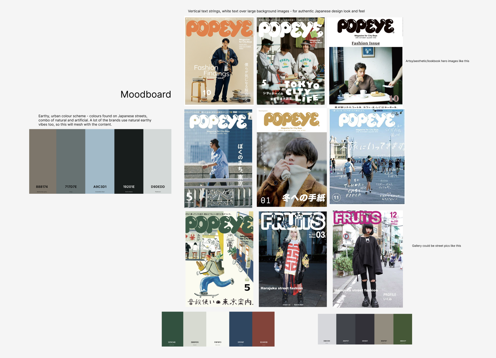

# boku-no-style


## Description

*Boku no Style* is an app designed for enthusiasts of Japanese streetwear fashion - or people who are interested in finding out more about it!

I was inspired to create this app because I lived in Japan for two years, which was when I became particularly interested in and passionate about Japanese fashion. Japan has a unique and storied fashion history. Although there are some resources out there for Western and other non-Japanese fans, it is mainly led by passionate members of the community and there can be a high barrier to entry - a combination of language, different countries, difficulty shipping, and more makes it difficult to research and obtain pieces.

So it seemed like a gap in the market for this kind of resource - I also knew there was a keen demand to tap into.

Japan is also a hugely popular tourist destination, with its cities being major attractions - since shopping is a popular activity while on a city break, the app is intended to help users research potential brands they would like to visit while on vacation. People often want something unique - I personally had many friends ask me for recommmendations on where to buy cool things while they were visting.

The app allows users to view different brands and find out more information about them. If they are logged in, they can add brands to their favourite list and add new brands they discover.

A key aspect is the social 'community' nature of the app. Users can upload pictures to each brand's 'gallery' section, such as selfies, clothing hauls, etc.

'Boku no' translates to 'My' in Japanese, so the app is essentially called 'My Style'. If I were developing this as a concept, you could expand on this idea and create hubs for different countries - a 'Mon Style' for people wanting to learn about France's fashion gems, for instance!

## Deployment link

[Boku no Style](https://boku-no-style.netlify.app/)

## Timeframe

This was a solo project created over the course of one week.

## Technologies used

*Boku no Style* is a full-stack project developed in *VS Code* using the following technologies:
* MEN Stack
    * MongoDB
    * Express
    * Node.js
* HTML
* CSS
* JavaScript

## Brief

This was the second project I completed as part of my software engineering bootcamp at General Assembly.

The brief was to create a MEN Stack app with full CRUD functionality. As a minimum, it needed to:
* Utilise EJS templates to render views to users
* Include session-based authentication
* At least two data entities, including a User model
* Full CRUD functionality
* Feature authorisation - only logged in users can create, update, or delete data
* Be deployed online

## Planning

Given that this is an app about fashion, I decided early on that I wanted it to be visual heavy and make use of photography to best showcase the subject matter.

I developed a wireframe plan of the site's main pages in *Figma*. The app was designed with a mobile version primarily in mind.


I also created a moodboard to help establish the look and feel of the app. I was particularly inspired by the design ethos of Japanese fashion/lifestyle magazines *Popeye* and *Fruits*.

I really wanted to create something that felt authentic and true to the subject matter. As such, I decided to include features such as white text over large images, chunky 'bubble'-like fonts, and vertical text strings.



This research also inspired my colour scheme. In its very name, streetwear is fashion that people wear out and about, on the streets. In the fashion covers I found, I loved how the steets themselves were an important, harmonious part of the photography, serving as a vital backdrop to highlight the models and clothes.

I decided to literally use the colours that made up these street views as my site's colour scheme - featuring an array of natural colours combined with the cool artificial colours of materials like concrete and reflective glass.

Work to plan the backend of the app was also completed - a routing table planning my desired routes and an ERD table outlining my relationships were produced.


I created a user story on Trello

PICTURE

## Build/Code process

The first step was to create a functioning website, so it made sense to start things off by creating a server and landing page.

To better organise the code, I then created a controller file called `brands.js` to define all the CRUD routes needed for the brands pages. This included `GET` routes for all associated pages - like the index, show, new form, and edit form pages. It also contains the `CREATE`, `PUT`, and `DELETE` routes for full functionality.

I also created a separate `auth.js` controller file to handle sign up and sign in routes and pages. Having these separate files allowed my `server.js` file to remain nice and lean, as can be seen in its final iteration:

```
//! -- Route handlers
//* -- Landing page
app.get('/', async (req, res) => {
    res.render('index.ejs')
})

//* -- Controllers
app.use('/brands', brandsController)
app.use('/auth', authController)

//! -- 404
app.get('*', (req, res) => {
    return res.status(404).render('404.ejs')
})
```

The navbar was created as a partial so that it could be easily integrated into all other pages as necessary.

For this project, I required two main models: a user mode and a brands model, which were created using mongoose.

I decided to implement seeding to improve the testing and development process - it was very useful to have a clean set of test data to return to after testing. This also made it easier to add new features, such as adding an `addedBy` field to brands after initial set up. This allowed me to assign a user as the 'owner' of each brand, which in turn enabled me to implement authorization and ensure only owners could edit or delete brands.

By this point, I had achieved my goal of hitting MVP well within half of my total timeframe for the whole project, which meant I had sufficient time to add additional features and styling.

After MVP, my first priority was to add the ability to 'like' brands, as this was a core feature of the intended website. added the ability to 'favourite' different brands. This was achieved by implementing a many-to-many relationship between brands and users. This was the most complex part of the project so far, and required reading around on how to implement.

I used a `push()` method to add the user's id to an array called 'fans' in the brand model. My thinking here was it would allow me to easily display the number of people who had favourited each brand on their pages. I then created a virtual field on the user model to allow users to access a list of all the brands they like on their profile. In hindsight, I think it would make sense to do this the other way round.

At this stage, the website was still very basic, so I implemented some basic styling. In the future, I think it would make sense to do a little more of this as I go along, as a little goes a long way to making the project feel more complete.

Because this is a fashion website, imagery is very important, so I added the ability to upload images when creating brands. The website uses *cloudinary* to host images, and images are automatically uploaded there when users add images to forms.

The bulk of the styling was then added. I wanted the app to work weel and scale across mobile and desktop screens. So it was important to me to ensure images scaled correctly and that both views had a complete look.

With mobile and desktop views in mind, have to strive to create a design that looks good across two different viewpoints. Some, like the brands index and profile pages, immediately scaled well between the two views. The show page was one I found most difficult to get right - I liked the way it looked on mobile view but not as a bigger screen

The ability to upload images to the gallery was also added and went smoothly after already implementing it once. I wanted to challenge myself by adding more than just simple comments, so I am pleased with how this went.

I thought it would be really cool to display the gallery as a carousel of images. I implemented *bootstrap* to help me do this,

## Challenges

no huge stumbling blocks - there are some parts I will come back to later after setting up basic functionality, like adding pictures to the brands model
at first

day 3


One of the early challenges I faced was trying to implement too many features at once. This made me realise that it was far more effective to break the project down into more manageable steps. That's one thing I learned from this project, it helps if you are clear on a set order - and be ok with the fact that you may rebuild and expand on parts later. It's important to check the steps are working correctly before implementing more complex parts.

The biggest issue I faced during this project was when I accidentally broke the whole project through a misunderstanding. When installing a dependency, I saw a message about it having vulnerabilities - because I am new to this, I interpreted this an a problem with my project. So, I followed the directions to force an update and broke the app! I learned the hard way that these are general issues and not ones specific to my app that actually need addressing - it's safe to say I won't be making that error again! I managed to solve this by deleting the lines of code that had my dependencies in the `package.json` file, then removing `node_modules` and `package-lock.json` before re-installing all my dependencies afresh.


problem = realised that after adding createdBy fiedl and adding it in my seeds to help populate the websitre and reset after testing. Duritnf testing found that I had forgotten to associated the session's user as createdBy when adding new brands

avoiding errors on show page required time and effort - to make sure that certain info only showed when the relevant user was logged in.


Creating the cards for each brand on the index page was one of the most challenging aspects to get right, and I am very pleased with how they eventually worked out. I did a lot research and experimenting to ensure that they worked as intended. Getting the text to sit in the centre of the brand cards required the card to use `relative` positioning using CSS. The title, a child element of this card, then used `absolute` positioning.

```
.brand-card {
    position: relative;
    transition: 0.3s;
}

.brand-title {
    color: white;
    font-size: 30px;
    position: absolute;
    top: 50%;
    left: 50%;
    transform: translate(-50%, -50%);
    text-align: center;
    font-family: 'Bungee Inline';
    text-shadow: 2px 0 5px #453d2e;
}
```

This was the part of the project which required the most work to get my head around. Even after creating them, I then had the problem of them scrolling on top of the nav header when scrolling down:


I first set the navbar to be `sticky` so that it would stick at the top of the page. After some research, I discovered that setting the z-value fixed this issue.

Sometimes, it was a challenge to ensure that pages looked good across different screen sizes. At first, I felt that my show page in particular looked good on a small mobile screen, but then didn't look as good when the screen became much wider. To counteract this, I decided to set a max width to preserve the integrity of the layout. However, this is something I want to research further as I believe it's really important for a website to look good at different widths in the modern age.

I implemented bootstrap to make a carousel to display images in the gallery on brand show pages. This required adding bootstrap's stylesheet. Because I implemented this at a later stage, it altered  some of my previous styling and ruined the effect I had created. This taught me that it would have been wiser to implement this at the beginning of the project to prevent this.

In particular, my logo was changed because it has a border around the text. I didn't want to put the bootstrap css stylsheet on all my other pages, because this would alter and break a lot of styling on other pages as well. But as it stood, my logo now changed between the show page and other pages, which was bad. So, I had to check through everything with a fine-toothed comb by inspecting every part of the page using dev tools in *Chrome*.

Eventually, I identified that the problem was that the bootstrap stylesheet altered the line height, which my personal stylsheet did not. This was causing the logo to display differently. It was very satisfying to find the culprit.

I really struggled with getting the homepage to look good and scale well. It was probably the biggest sticking point of the whole project. I researched a lot of home pages on other websites for inspiration and plan to look more at good examples

## Wins

Ultimately, I am really pleased with the look and feel of the site - I challenged myself to make it visual heavy and use images as backgrounds, and was happy with how the show page turned out.


I got the images to scale appropriately to fit the exact shape of the cards on the index page, as well as scale with the show page. Images added to the gallery also scale and I am pleased I managed to integrate the carousel, as I thought this may be too difficult to include when embarking on the project.


I am very pleased with the cards on the index page - as detailed above they were a challenge to create, but I think the final effect really works. I was able to add some animations in CSS when hovering over them to make the site feel more dynamic. 

```
.brand-card:hover {
    opacity: 75%;
    transform: scale(1.02);
}
```

This is something I would really like to explore further, as I think animations and responsive content can really elevate the look and feel of a website.

## Key learnings/Takeaways

I learned how much I don't know - although I am pleased with how the app turned out, I still think it is clear that it is a beginner project.

I would like to learn more about responsive designs - everything resizes nicely, but it would be good to include more dynamic changes, such as changing the order and display of content.

## Future Improvements

I think *Boku no Style* works well as a base concept that has lot of potential to be improved and built upon.

A filtering system for brands would be a nice feature - this could narrow down brands based on the already present price point, but also additional info like menswear/womenswear, etc. Similarly, the ability to sort and search the list of brands would be useful.

In my initial plan, I wanted to include location information, so that users could see where to find physical locations of the stores as well as their websites. Within my timeframe for the project, gathering this information would have been too time consuming, so I reluctantly left it out. It would also have replicated the use of reverse virtual populating fields and so I decided to prioritise different functionality within my timeframe.

With the location information included, users would be able to plan shopping trips during their visits to Japan. This is often one of the easiest way to source Japanese fashion, as many brands do not offer websites in English or overseas shipping, and physical retail is thriving in the country.

If I were launching this as an actual business, affiliate links would be an excellent addition! Becuase of its heavy ties with shopping, the website lends itself well to this idea.

I would also like to include more dynamic changes between mobile and desktop views. This could, for example, include a hamburger menu on the navbar for mobile view and allowing multiple images to be shown at once in the carousel in desktop view.


day 1
Started work on the project
First step is to create a functioning website
created a server and landing page
next created a brands controller to define the brands routes
created a navbar
created the two main models I need - user model and brand model
no huge stumbling blocks - there are some parts I will come back to later after setting up basic functionality, like adding pictures to the brands model


day 2
sorted CRUD for the brands
made sign up and sign in forms


day 3
biggest issue was migraine...
no huge issues to begin with - problem solving of errors was just minor syntax mistakes with sign in form
signing in and creating a session went fine - I tried to integrate too many features simultaneously, so had to break down the steps and add functionality in set stages to enable all the things I needed to do
That's one thing I learned from this project = there are many steps and it helps if you are clear on a set order - and be ok with the fact that you may rebuild parts later. It's important to check the steps are working correctly before implementing more complex parts.
after completing the brands and auth controllers, things seem less straightforward - requires more thinking about next steps. Decided to create a seeds while adding an 'addedBy' section to the brand model. This gives me a clean slate of data to test with, and allows me to ensure only users who created certain brands have the rights to edit or delete them.
Made it so that only the person who added the brand to the website has the ability to edit

day 4
today's plan is MVP
ability to add favourites
ability to upload images
then error handling
then comments
these are the most important things for it to work
First priority was to add the ability to 'like' brands, as this is a core feature of the website. Managed to implement this by implementing a many-to-many relationship between brands and users, the most complex part of the project so far, which required reading around how to implement this. Created a virtual field on the user model to allow users to access a list of all the brands they like on their profile.
Implemented some basic styling - in hindsight I would have done this sooner just for piece of mind, as a little goes a long way to making the product feel more complete.
had an issue with vulnerabilities in dependencies - forced update and broke the app. learned the hard way that these are general issues and ones specific to my app that actually need addressing. ended up solving by deleting the lines that had my dependencies in package.json, removing node_modules and package-lock.json and re-installing them all
problem = realised that after adding createdBy fiedl and adding it in my seeds to help populate the websitre and reset after testing. Duritnf testing found that I had forgotten to associated the session's user as createdBy when adding new brands
initially wanted to upload two separate images in diff fields, but this didnt work as I intended

day 5
today's plan is styling and giving each page an identity and populating the website with more initial info to make it more useful and interesting
carousel?
error handling
wanted the app to work on mobile screens as well as desktop
avoiding errors on show page required time and effort - to make sure that certain info only showed when the relevant user was logged in.
With mobile and desktop views in mind, have to strive to create a design that looks good across two different viewpoints. Some, like the brands index and profile pages, immediately scaled well between the two views. The show page was one I found most difficult to get right - I liked the way it looked on mobile view but not as a bigger screen
the positioning of the cards...
position took a bit of gettin my head around. getting the text to sit in the centre of the brand cards required the card to be relativelypositioned. These would then scroll over the nav header whenever I tried to set it to be `sticky` at the top of the page. After some research, I discovered that setting a z-value could help with this.
show page - looked good on small screen style, but scales to full width badly. This is something I want to research further as I believe it's really important.

day 6
error handling
X add gallery pics
X check his image changes
homepage
X remove references to logo
X delete dead code
check requirements
X some responsive bits
deploy

decided against location... given my timeframe, gathering the information would have been too time consuming. it was also replicating the reverse virtual populate of the profile page and wanted to prioritise diff functionality for the purposes of this app
uploading images to a gallery went quite smoothly
used bootstrap to make a carousel - adding the new stylesheet to do this broke some of my previous styling so had to check throuhg everything with a fine-toothed comb
this really stressed me - ended up being the line height that was set wrongly and messed up my logo. Couldnt add to every page as it broke everything each time. Glad I found the culprit by investigating intensively on inspect
I really struggled with the homepage... getting it to match the style and scale well... adn just look good in general. It was probably the biggest sticking point of the whole project. wanted it to look good because it's the first impression.

Day 7
X homepage
error handling
X check requirements
X deploy